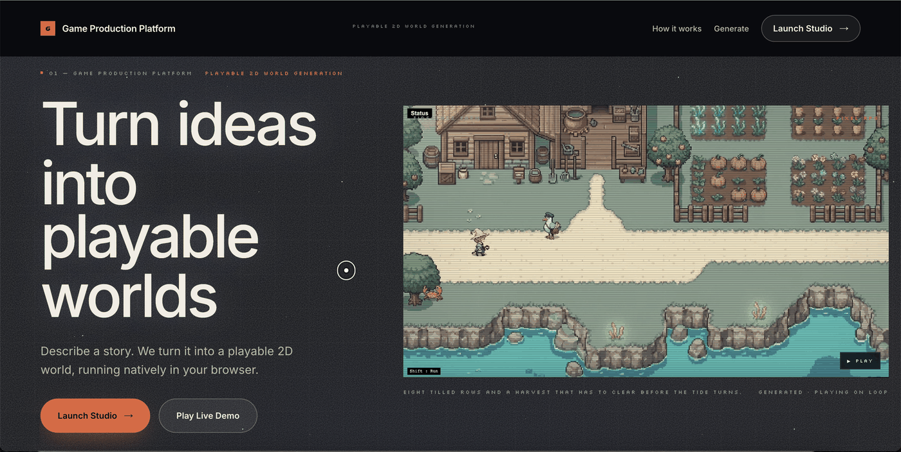
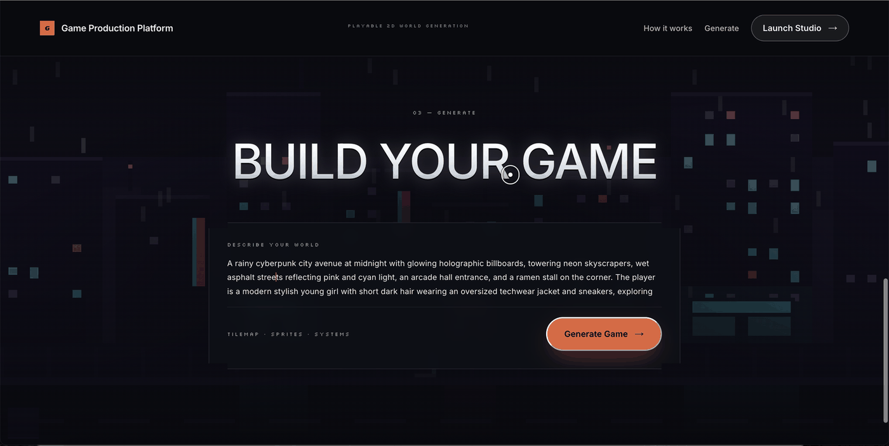
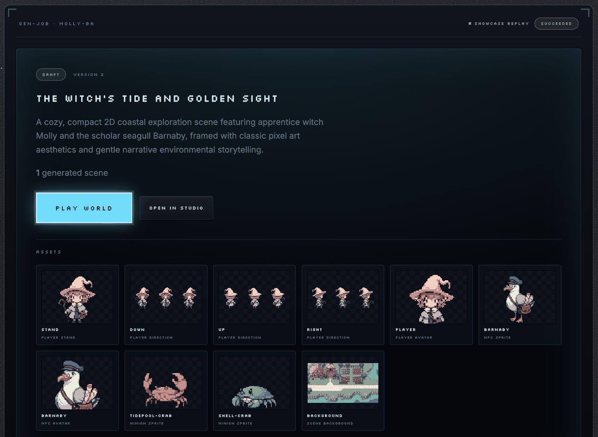
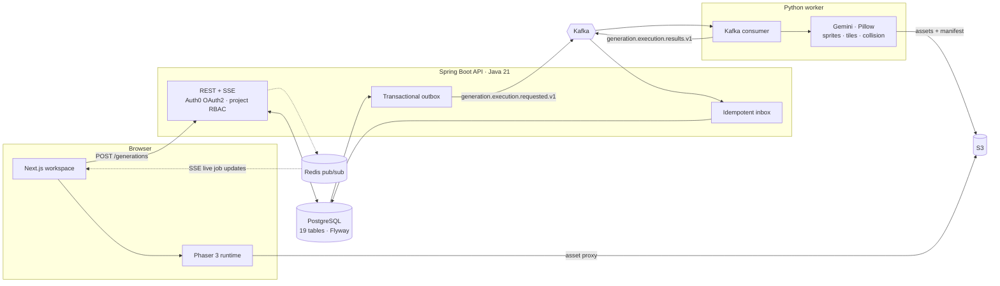

# Game Production Platform

**Describe a story. Get a 2D world you can walk around in your browser.**

### [▶ Open the live site](https://game-generation-platform.vercel.app)



---

## How it works

A prompt becomes a generated world through an event-driven pipeline, and the result is playable without leaving the browser.

| | |
|---|---|
| **1 · Generate** | A prompt becomes sprites, tilemaps, collision geometry and a validated manifest |
| **2 · Version** | Every run is kept as an immutable snapshot — nothing overwrites the one you liked |
| **3 · Review** | Role-scoped multi-reviewer approval before a version ships |
| **4 · Play** | Phaser 3 loads the manifest and renders the world in the browser |
| **5 · Export** | The approved version freezes into a content pack a game can load |

---

## Write a prompt



## Inspect what came out

Each run produces individually generated assets — directional walk frames, NPC avatars, minion sprites and the scene background — versioned, reviewable, and playable in one click.




## Architecture




---

## Tech stack

| | |
|---|---|
| **Front end** | Next.js 16 (App Router), React 19, TypeScript, CSS Modules |
| **Motion** | GSAP + ScrollTrigger, Lenis smooth scroll, Framer Motion |
| **Game runtime** | Phaser 3 |
| **API** | Java 21, Spring Boot 4.1, Spring Security OAuth2 (Auth0) |
| **Data** | PostgreSQL, Flyway, JPA / Hibernate |
| **Messaging** | Kafka · Redpanda, transactional outbox, Redis pub/sub + SSE |
| **Generation** | Python 3.12, confluent-kafka, Google Gemini, Pillow |
| **Storage** | AWS S3 · LocalStack |
| **Infra & CI** | Docker Compose, GitHub Actions, Testcontainers, k6 |

---

## Run it

```bash
cp .env.example .env          # Auth0 dev tenant + GEMINI_API_KEY
docker compose -f infra/local/compose.yaml up --build
```

Brings up `postgres`, `api`, `web`, `redpanda`, `redis`, `s3` and `generation-worker`.
Web on [localhost:3000](http://localhost:3000), API on [localhost:8080](http://localhost:8080).

```bash
cd services/api && ./mvnw verify          # unit + Testcontainers integration tests
cd apps/web && npm ci && npm test         # Vitest
```

---

## Layout

```
apps/web/             Next.js — landing, workspace, generation console, Phaser host
services/api/         Spring Boot — auth · generation · content · review · pack · credit
workers/generation/   Python worker — Kafka consumer, Gemini, Pillow, S3
infra/local/          Docker Compose stack
tests/                Runtime smoke tests, canary premises, k6 load scenario
scripts/              Repository security scan
legacy/playrpg/       Preserved prototype — reference only, excluded from deploys
```
