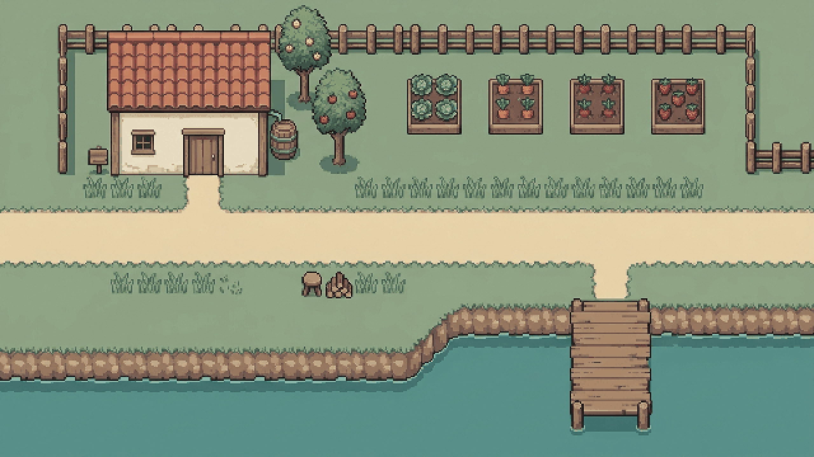
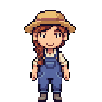

# Tideglass Farm — original seaside-farm canary

This is the default public example for Playable Game Content V1. Its premise lives in [`tests/canary/tideglass_farm_jrpg.json`](../../tests/canary/tideglass_farm_jrpg.json). The setting, characters, and dialogue were written for this repository; it does not reuse the preserved legacy sample stories or game assets.

Mira's small farm combines readable crop beds, a one-story cottage, a clear footpath, and a nearby coast in one compact scene. Rowan brings kelp compost and helps repair an irrigation gate before the first harvest market. The intended palette is gentle sage, cream, dusty teal, weathered blue, and a single muted coral accent. This is a visual/playable exploration example, not a farming-mechanics demo: planting, harvesting, and inventory actions are not implemented in V1.

The images below are from a credential-backed local canary using the production generation worker. They are original generated example assets, not the complete runtime bundle; the playable manifest and remaining directional/NPC assets live in local object storage.

The test deliberately names concrete character features and landmarks. The worker's permanent visual anchor, pixel-art constraints, asset dimensions, and Phaser world-coordinate contract remain separate from this example; changing the example must not change defaults for other stories.

For a credential-backed run, submit the `prompt` value as a generation request to a local test project with credits and a configured Gemini key. Do not commit a key, JWT, downloaded provider output, or generated object-store files without inspecting them first. Automated worker tests use synthetic provider output instead.
